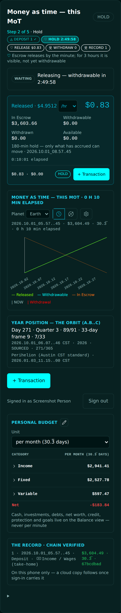
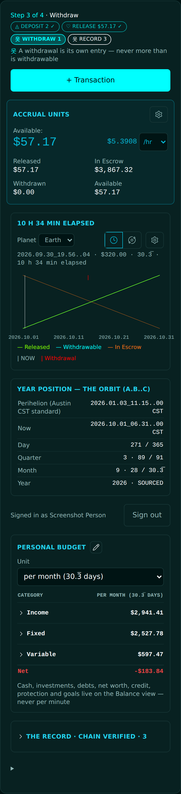
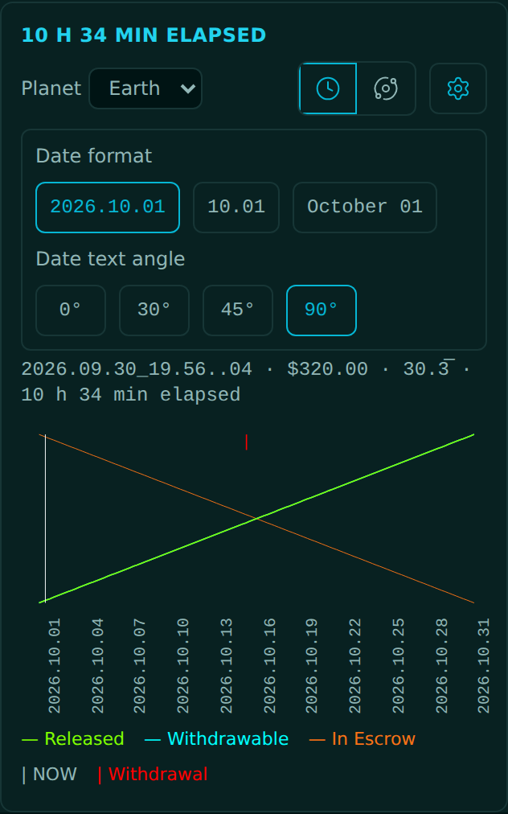
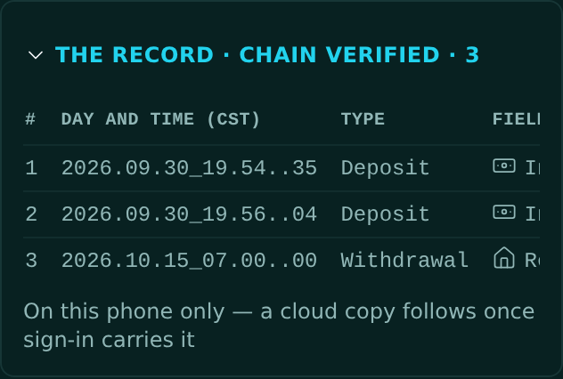

<!-- release-note
{
 "rev": "028",
 "date": "2026-10-01",
 "title": "Your morning list, every item: no hold, one + Transaction, Accrual Units, two-line title",
 "words": [
  {
   "text": "there is no 180 min rule( that was just example).  if 2 hours later, 120 min at $/min should work.",
   "addendum": "57"
  },
  {
   "text": "Measure of Time Financial System should be at top.  remove All Version info as it is at bottom alreadyZ\nSettings sjpuld open up date format for table, and angle for chart text.  Notnsure why youbignored my input\nplace time and settings ton right with space between Planet Earth\nHow many transaction inputs buttons are there? seems like there should be one primary at top. did you do a UX REVIEW?\nthis is sloppy, either hide and click to expand with better table or make every entry on a single line with ability tonscroll to right.\nMoney as time — this MoT / i said to remove this phrase! / Use two lines / \"Measure of Time\" / \"A Universal Standard\"\nmake full table full width on phone portrait mode\nremove gold top box, / purple second box should have settings button upper right and move $/min and selector to right side.  Call this \"Accrual Units\" / \"Available:  \" ### / Keep transaction, remove withdrawal (as the the in the down of transaction). / should be Current balance should be on left\nTHERE IS NO 180 min hold!\non Trinity logo; black text is perfect . / remove ghost / shadow pink text (same color of trinity).\nthis needs to be cleaned: / I said to remove all 33 day reference; inis 30.333 (30.3 repeating sign). / use table and place key info in order. perihelion is first",
   "addendum": "58"
  }
 ],
 "changed": [
  "No hold: whatever has accrued at $/min can move at once (the hold line, the Held refusal and the HOLD step are gone)",
  "Header: FINANCIAL · 2525, then Measure of Time / A Universal Standard on two lines; no version line at the top",
  "One + Transaction at the top; the gold YOUR TURN box and the other doors are gone",
  "The card is Accrual Units: Available on the left, $/min and its selector on the right, a gear upper right; no Withdraw pill",
  "Chart gear opens the date format and the date angle (0° · 30° · 45° · 90°); Planet left, Clock · MoT · gear right",
  "The Record folds; opened, one line per entry that scrolls sideways",
  "The year is a table, perihelion first; no 33-day reference anywhere"
 ],
 "notChanged": [
  "Your recorded entries, their amounts and their chain hashes",
  "The budget table and its units",
  "The data colours on the chart"
 ],
 "measured": [
  "A withdrawal of 120 min × $/min, 2 hours after a deposit: accepted; one cent more: refused, naming the minute",
  "Accrual Units card width = page width at 390 px",
  "Chart dates drawn at 45° and 90°"
 ],
 "recommendation": "none",
 "sha": "20dcfb5",
 "verify": {
  "run": "#2107",
  "state": "pass"
 },
 "images": {
  "before": "img/r.028-before.png",
  "after": "img/r.028-after.png",
  "extra": [
   {
    "label": "After · chart at 90°",
    "src": "img/r.028-after-chart.png"
   },
   {
    "label": "After · Record opened",
    "src": "img/r.028-after-record.png"
   },
   {
    "label": "After · year table",
    "src": "img/r.028-after-year.png"
   }
  ]
 }
}
-->
# r.028 · Your morning list, every item: no hold, one + Transaction, Accrual Units, two-line title

2026-10-01 · https://exel-ai-polling.explore-096.workers.dev/financial-2525

```text
r.028 · Your morning list, every item: no hold, one + Transaction, Accrual Units, two-line title
Your words: "there is no 180 min rule( that was just example).  if 2 hours later, 120 min at $/min should work."   (addendum 57)
            "Measure of Time Financial System should be at top.  remove All Version info as it is at bottom alreadyZ
Settings sjpuld open up date format for table, and angle for chart text.  Notnsure why youbignored my input
place time and settings ton right with space between Planet Earth
How many transaction inputs buttons are there? seems like there should be one primary at top. did you do a UX REVIEW?
this is sloppy, either hide and click to expand with better table or make every entry on a single line with ability tonscroll to right.
Money as time — this MoT / i said to remove this phrase! / Use two lines / "Measure of Time" / "A Universal Standard"
make full table full width on phone portrait mode
remove gold top box, / purple second box should have settings button upper right and move $/min and selector to right side.  Call this "Accrual Units" / "Available:  " ### / Keep transaction, remove withdrawal (as the the in the down of transaction). / should be Current balance should be on left
THERE IS NO 180 min hold!
on Trinity logo; black text is perfect . / remove ghost / shadow pink text (same color of trinity).
this needs to be cleaned: / I said to remove all 33 day reference; inis 30.333 (30.3 repeating sign). / use table and place key info in order. perihelion is first"   (addendum 58)
Changed:    • No hold: whatever has accrued at $/min can move at once (the hold line, the Held refusal and the HOLD step are gone)
            • Header: FINANCIAL · 2525, then Measure of Time / A Universal Standard on two lines; no version line at the top
            • One + Transaction at the top; the gold YOUR TURN box and the other doors are gone
            • The card is Accrual Units: Available on the left, $/min and its selector on the right, a gear upper right; no Withdraw pill
            • Chart gear opens the date format and the date angle (0° · 30° · 45° · 90°); Planet left, Clock · MoT · gear right
            • The Record folds; opened, one line per entry that scrolls sideways
            • The year is a table, perihelion first; no 33-day reference anywhere
Not changed: • Your recorded entries, their amounts and their chain hashes
             • The budget table and its units
             • The data colours on the chart
Measured:   • A withdrawal of 120 min × $/min, 2 hours after a deposit: accepted; one cent more: refused, naming the minute
            • Accrual Units card width = page width at 390 px
            • Chart dates drawn at 45° and 90°
My recommendation / question: none
SHA 20dcfb5 | committed ✓ | pushed ✓ | Verify Live #2107 ✓
```










