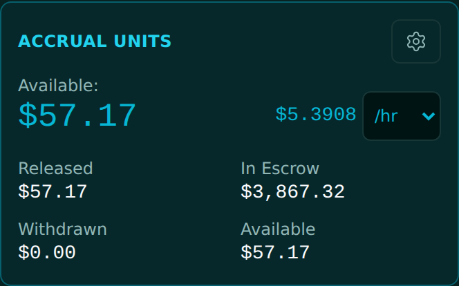
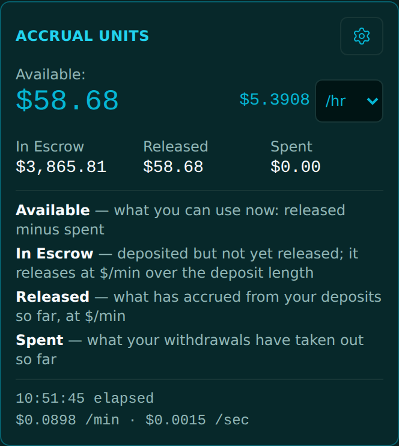

<!-- release-note
{
 "rev": "029",
 "date": "2026-10-01",
 "title": "Three boxes, not four: In Escrow · Released · Spent, and the gear explains each",
 "words": [
  {
   "text": "doesn't this seem duplicative? Only have two versus 4 boxes:\n\nIn Escrow\nReleased\nSpent\n\nSince available is at top; users will see and understand link to released\n\nor you can tell me why 4 fields and whatveach does (which should be inn settings).",
   "addendum": "60"
  }
 ],
 "changed": [
  "Available stays the one big figure at the top",
  "The grid is three boxes: In Escrow · Released · Spent (Withdrawn renamed Spent; the repeated Available box is gone)",
  "The gear explains each figure: Available, In Escrow, Released, Spent"
 ],
 "notChanged": [
  "The numbers and how they are computed",
  "The rate and its /hr selector"
 ],
 "measured": [
  "Three boxes in the grid, no second Available"
 ],
 "recommendation": "none",
 "sha": "0add99b",
 "verify": {
  "run": "#2113",
  "state": "pass"
 },
 "images": {
  "before": "img/r.029-before.png",
  "after": "img/r.029-after.png",
  "extra": [
   {
    "label": "After · gear open",
    "src": "img/r.029-after-gear.png"
   }
  ]
 }
}
-->
# r.029 · Three boxes, not four: In Escrow · Released · Spent, and the gear explains each

2026-10-01 · https://exel-ai-polling.explore-096.workers.dev/financial-2525

```text
r.029 · Three boxes, not four: In Escrow · Released · Spent, and the gear explains each
Your words: "doesn't this seem duplicative? Only have two versus 4 boxes:

In Escrow
Released
Spent

Since available is at top; users will see and understand link to released

or you can tell me why 4 fields and whatveach does (which should be inn settings)."   (addendum 60)
Changed:    • Available stays the one big figure at the top
            • The grid is three boxes: In Escrow · Released · Spent (Withdrawn renamed Spent; the repeated Available box is gone)
            • The gear explains each figure: Available, In Escrow, Released, Spent
Not changed: • The numbers and how they are computed
             • The rate and its /hr selector
Measured:   • Three boxes in the grid, no second Available
My recommendation / question: none
SHA 0add99b | committed ✓ | pushed ✓ | Verify Live #2113 ✓
```





