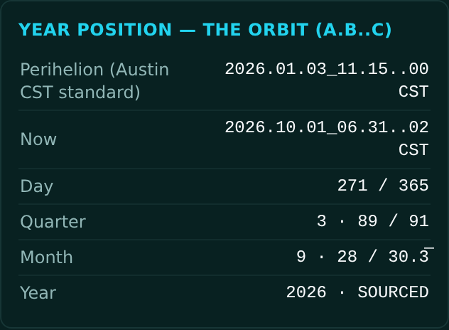
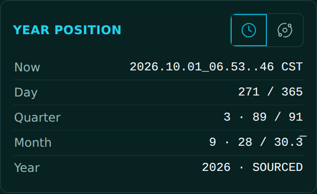
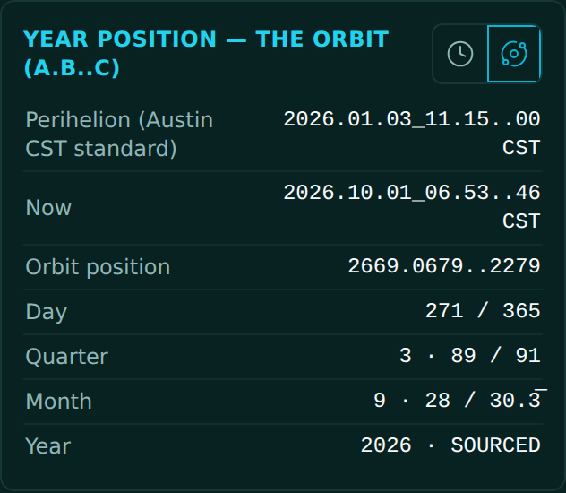

<!-- release-note
{
 "rev": "030",
 "date": "2026-10-01",
 "title": "The year card has its own Clock / MoT toggle, standard by default",
 "words": [
  {
   "text": "year position should have time / MoT icon and default to standard , when MoT is clicked orbital info unlocks",
   "addendum": "61"
  }
 ],
 "changed": [
  "The year card has its own Clock ⇄ MoT toggle (the same one the chart uses), on Clock by default",
  "Standard rows: Now · Day N/365 · Quarter · Month · Year",
  "MoT adds the perihelion that opened the year (first) and the orbit position in A.B..C",
  "The chart's toggle no longer changes the year card"
 ],
 "notChanged": [
  "The chart and its own toggle"
 ],
 "measured": [
  "Fresh page: the year card reads standard rows, no A.B..C"
 ],
 "recommendation": "none",
 "sha": "6a7178d",
 "verify": {
  "run": "#2116",
  "state": "overtaken",
  "via": {
   "run": "#2117",
   "state": "pass",
   "sha": "c6b1a65",
   "why": "the bookkeeping push 3 s later, which contains r.030"
  }
 },
 "images": {
  "before": "img/r.030-before.png",
  "after": "img/r.030-after.png",
  "extra": [
   {
    "label": "After · MoT pressed",
    "src": "img/r.030-after-mot.png"
   }
  ]
 }
}
-->
# r.030 · The year card has its own Clock / MoT toggle, standard by default

2026-10-01 · https://exel-ai-polling.explore-096.workers.dev/financial-2525

```text
r.030 · The year card has its own Clock / MoT toggle, standard by default
Your words: "year position should have time / MoT icon and default to standard , when MoT is clicked orbital info unlocks"   (addendum 61)
Changed:    • The year card has its own Clock ⇄ MoT toggle (the same one the chart uses), on Clock by default
            • Standard rows: Now · Day N/365 · Quarter · Month · Year
            • MoT adds the perihelion that opened the year (first) and the orbit position in A.B..C
            • The chart's toggle no longer changes the year card
Not changed: • The chart and its own toggle
Measured:   • Fresh page: the year card reads standard rows, no A.B..C
My recommendation / question: none
SHA 6a7178d | committed ✓ | pushed ✓ | Verify Live #2116 overtaken → #2117 ✓ on c6b1a65 (the bookkeeping push 3 s later, which contains r.030)
```






