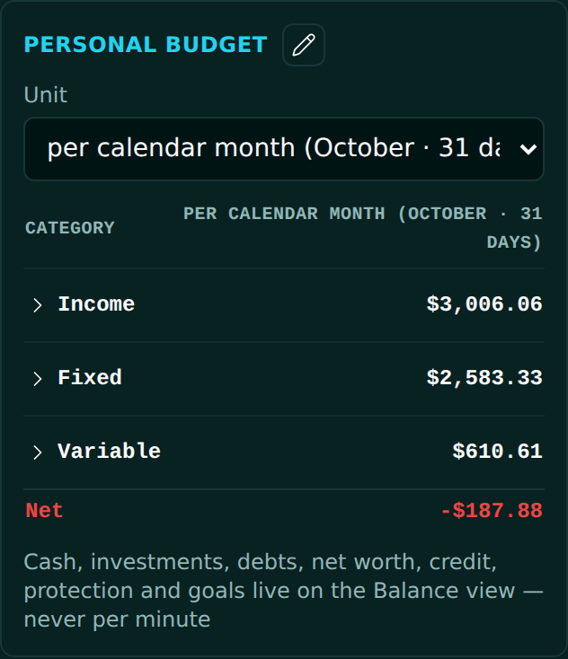

<!-- release-note
{
 "rev": "031",
 "date": "2026-10-01",
 "title": "per calendar month (October · 31 days) before the 30.3̅-day month",
 "words": [
  {
   "text": "for personal budget we should also have standard month added before month 30.3 (1st day of Gregorian calendar , even though its not even nor does it reflect reality).",
   "addendum": "62"
  }
 ],
 "changed": [
  "The budget's unit list gains \"per calendar month (October · 31 days)\" right before \"per month (30.3̅ days)\"",
  "It uses the real length of the month you are in (28–31 days, Austin CST)"
 ],
 "notChanged": [
  "The default stays per month (30.3̅ days)",
  "Your budget amounts"
 ],
 "measured": [
  "$3,924.49 per 30.3̅-day month reads $4,010.75 per October"
 ],
 "recommendation": "none",
 "sha": "82864ea",
 "verify": {
  "run": "#2119",
  "state": "pass"
 },
 "images": {
  "before": null,
  "beforeNote": "No BEFORE capture of the unit list was taken at r.030.",
  "after": "img/r.031-after.png"
 }
}
-->
# r.031 · per calendar month (October · 31 days) before the 30.3̅-day month

2026-10-01 · https://exel-ai-polling.explore-096.workers.dev/financial-2525

```text
r.031 · per calendar month (October · 31 days) before the 30.3̅-day month
Your words: "for personal budget we should also have standard month added before month 30.3 (1st day of Gregorian calendar , even though its not even nor does it reflect reality)."   (addendum 62)
Changed:    • The budget's unit list gains "per calendar month (October · 31 days)" right before "per month (30.3̅ days)"
            • It uses the real length of the month you are in (28–31 days, Austin CST)
Not changed: • The default stays per month (30.3̅ days)
             • Your budget amounts
Measured:   • $3,924.49 per 30.3̅-day month reads $4,010.75 per October
My recommendation / question: none
SHA 82864ea | committed ✓ | pushed ✓ | Verify Live #2119 ✓
```

BEFORE: No BEFORE capture of the unit list was taken at r.030.


