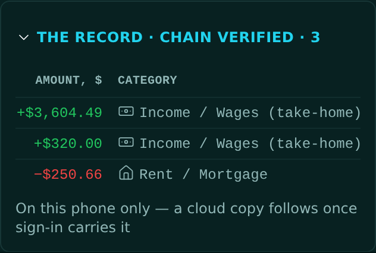

<!-- release-note
{
 "rev": "032",
 "date": "2026-10-01",
 "title": "The Record leads with Amount, then Category",
 "words": [
  {
   "text": "Master of Thought:\n\nthe record chain needs dollar and then spend category as front two columns; order by logic (as you are master of knowing humanity)",
   "addendum": "63"
  }
 ],
 "changed": [
  "Columns, left to right: Amount (signed: + in, − out) · Category · Memo · Day and time · Length · Type · # · Hash"
 ],
 "notChanged": [
  "The entries and their chain hashes",
  "The Record still folds and scrolls sideways"
 ],
 "measured": [
  "First two columns read Amount, Category on the built page"
 ],
 "recommendation": "Columns 3–7 (Memo · Day and time · Length · Type · # · Hash) are my order. Confirm or reorder.",
 "sha": "2fa0ac1",
 "verify": {
  "run": "#2122",
  "state": "pass"
 },
 "images": {
  "before": "img/r.032-before.png",
  "after": "img/r.032-after.png"
 }
}
-->
# r.032 · The Record leads with Amount, then Category

2026-10-01 · https://exel-ai-polling.explore-096.workers.dev/financial-2525

```text
r.032 · The Record leads with Amount, then Category
Your words: "Master of Thought:

the record chain needs dollar and then spend category as front two columns; order by logic (as you are master of knowing humanity)"   (addendum 63)
Changed:    • Columns, left to right: Amount (signed: + in, − out) · Category · Memo · Day and time · Length · Type · # · Hash
Not changed: • The entries and their chain hashes
             • The Record still folds and scrolls sideways
Measured:   • First two columns read Amount, Category on the built page
My recommendation / question: Columns 3–7 (Memo · Day and time · Length · Type · # · Hash) are my order. Confirm or reorder.
SHA 2fa0ac1 | committed ✓ | pushed ✓ | Verify Live #2122 ✓
```



