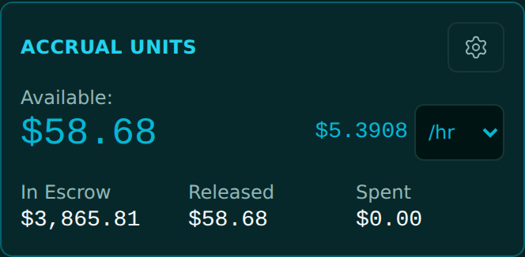
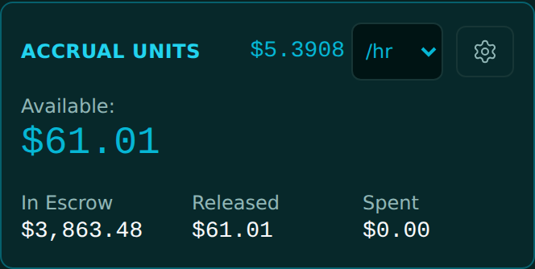
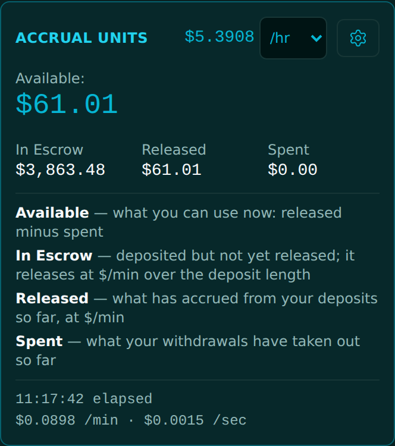

<!-- release-note
{
 "rev": "033",
 "date": "2026-10-01",
 "title": "The accrual rate on the top line, left of the gear; the explanations only behind the gear",
 "words": [
  {
   "text": "Accrual field needs to be left to settings button on top line",
   "addendum": "64"
  },
  {
   "text": "meaning 5.3908 / hour",
   "addendum": "65"
  },
  {
   "text": "this should only show when settings button clicked",
   "addendum": "66"
  }
 ],
 "changed": [
  "The rate ($5.3908) and its /hr selector sit on the Accrual Units title line, immediately left of the gear",
  "The four explanations and the elapsed lines show only when the gear is pressed"
 ],
 "notChanged": [
  "Available stays the big figure on the left",
  "The three boxes"
 ],
 "measured": [
  "Gear closed: no explanations on the card"
 ],
 "recommendation": "none",
 "sha": "ff3d8ff",
 "verify": {
  "run": "#2125",
  "state": "overtaken",
  "via": {
   "run": "#2126",
   "state": "pass",
   "sha": "d1573fc",
   "why": "the bookkeeping push 2 s later, which contains r.033"
  }
 },
 "images": {
  "before": "img/r.033-before.png",
  "after": "img/r.033-after.png",
  "extra": [
   {
    "label": "After · gear pressed",
    "src": "img/r.033-after-gear.png"
   }
  ]
 }
}
-->
# r.033 · The accrual rate on the top line, left of the gear; the explanations only behind the gear

2026-10-01 · https://exel-ai-polling.explore-096.workers.dev/financial-2525

```text
r.033 · The accrual rate on the top line, left of the gear; the explanations only behind the gear
Your words: "Accrual field needs to be left to settings button on top line"   (addendum 64)
            "meaning 5.3908 / hour"   (addendum 65)
            "this should only show when settings button clicked"   (addendum 66)
Changed:    • The rate ($5.3908) and its /hr selector sit on the Accrual Units title line, immediately left of the gear
            • The four explanations and the elapsed lines show only when the gear is pressed
Not changed: • Available stays the big figure on the left
             • The three boxes
Measured:   • Gear closed: no explanations on the card
My recommendation / question: none
SHA ff3d8ff | committed ✓ | pushed ✓ | Verify Live #2125 overtaken → #2126 ✓ on d1573fc (the bookkeeping push 2 s later, which contains r.033)
```






