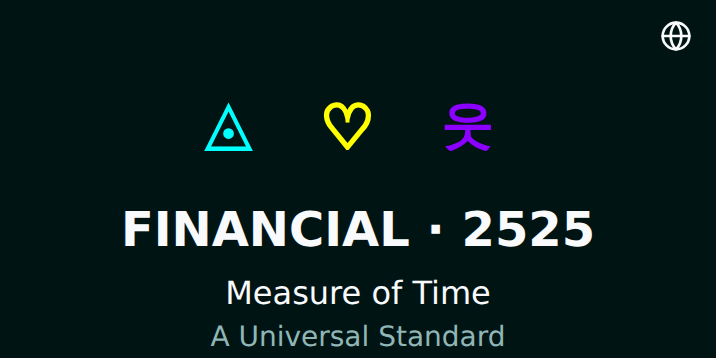
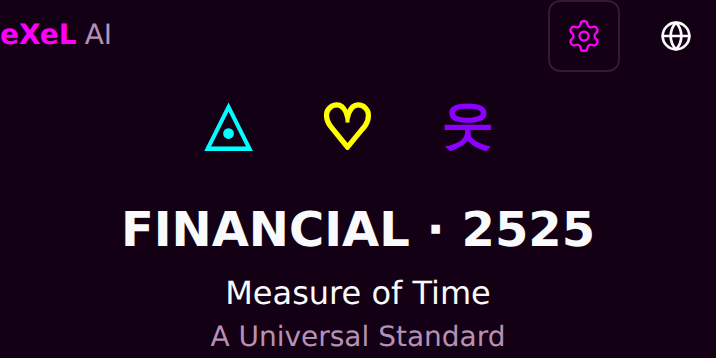
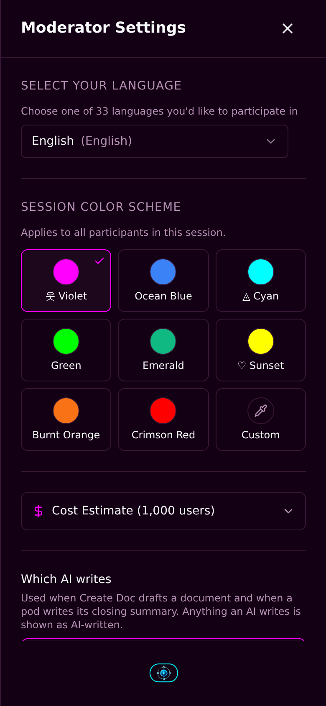
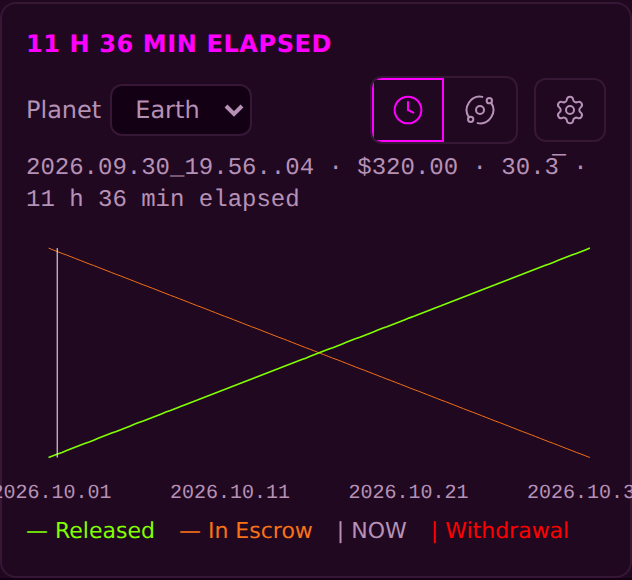

<!-- release-note
{
 "rev": "034",
 "date": "2026-10-01",
 "title": "eXeL AI upper left, Settings with your colour upper right; every accent follows the colour you pick",
 "words": [
  {
   "text": "settings with colors selector (from eXeL Polling shpuld be in ipper right; master color is violet in this example, but some text is cyan; remember we stick to color per selector.\n\nalso eXeL AI is missing on upper left to-take us back to /main",
   "addendum": "67"
  }
 ],
 "changed": [
  "eXeL AI at the upper left, a link back to /main",
  "The eXeL Polling Settings gear (with the colour selector) at the upper right, beside the globe",
  "Every fixed cyan accent now uses the colour picked in Settings",
  "The chart's cyan Withdrawable line and its legend word are removed (with no hold it always equals Released)"
 ],
 "notChanged": [
  "Chart data colours: deposits green, withdrawals red, Released green, In Escrow orange"
 ],
 "measured": [
  "Violet theme: no cyan text on the page"
 ],
 "recommendation": "The Withdrawable line stays removed unless you want it back in your colour.",
 "sha": "8a54582",
 "verify": {
  "run": "#2131",
  "state": "pass"
 },
 "images": {
  "before": "img/r.034-before.png",
  "after": "img/r.034-after.png",
  "extra": [
   {
    "label": "After · Settings open",
    "src": "img/r.034-after-settings.png"
   },
   {
    "label": "After · chart",
    "src": "img/r.034-after-chart.png"
   }
  ]
 }
}
-->
# r.034 · eXeL AI upper left, Settings with your colour upper right; every accent follows the colour you pick

2026-10-01 · https://exel-ai-polling.explore-096.workers.dev/financial-2525

```text
r.034 · eXeL AI upper left, Settings with your colour upper right; every accent follows the colour you pick
Your words: "settings with colors selector (from eXeL Polling shpuld be in ipper right; master color is violet in this example, but some text is cyan; remember we stick to color per selector.

also eXeL AI is missing on upper left to-take us back to /main"   (addendum 67)
Changed:    • eXeL AI at the upper left, a link back to /main
            • The eXeL Polling Settings gear (with the colour selector) at the upper right, beside the globe
            • Every fixed cyan accent now uses the colour picked in Settings
            • The chart's cyan Withdrawable line and its legend word are removed (with no hold it always equals Released)
Not changed: • Chart data colours: deposits green, withdrawals red, Released green, In Escrow orange
Measured:   • Violet theme: no cyan text on the page
My recommendation / question: The Withdrawable line stays removed unless you want it back in your colour.
SHA 8a54582 | committed ✓ | pushed ✓ | Verify Live #2131 ✓
```








