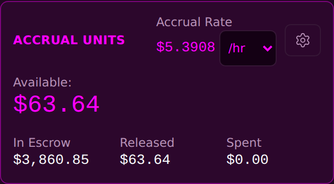

<!-- release-note
{
 "rev": "036",
 "date": "2026-10-01",
 "title": "The three boxes span the card",
 "words": [
  {
   "text": "spread 3 fields evenly full width of box",
   "addendum": "69"
  }
 ],
 "changed": [
  "In Escrow on the left edge, Released centred, Spent on the right edge"
 ],
 "notChanged": [
  "The figures and their labels"
 ],
 "measured": [
  "0 px from each edge; Released centred to 0 px"
 ],
 "recommendation": "none",
 "sha": "483401c",
 "verify": {
  "run": "#2138",
  "state": "overtaken",
  "via": {
   "run": "#2139",
   "state": "pass",
   "sha": "4994a8b",
   "why": "the bookkeeping push 3 s later, which contains r.036"
  }
 },
 "images": {
  "before": "img/r.036-before.png",
  "after": "img/r.036-after.png"
 }
}
-->
# r.036 · The three boxes span the card

2026-10-01 · https://exel-ai-polling.explore-096.workers.dev/financial-2525

```text
r.036 · The three boxes span the card
Your words: "spread 3 fields evenly full width of box"   (addendum 69)
Changed:    • In Escrow on the left edge, Released centred, Spent on the right edge
Not changed: • The figures and their labels
Measured:   • 0 px from each edge; Released centred to 0 px
My recommendation / question: none
SHA 483401c | committed ✓ | pushed ✓ | Verify Live #2138 overtaken → #2139 ✓ on 4994a8b (the bookkeeping push 3 s later, which contains r.036)
```




