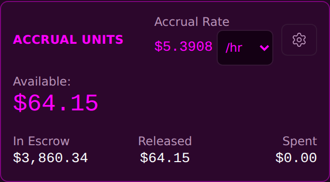
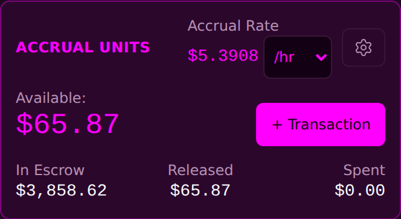
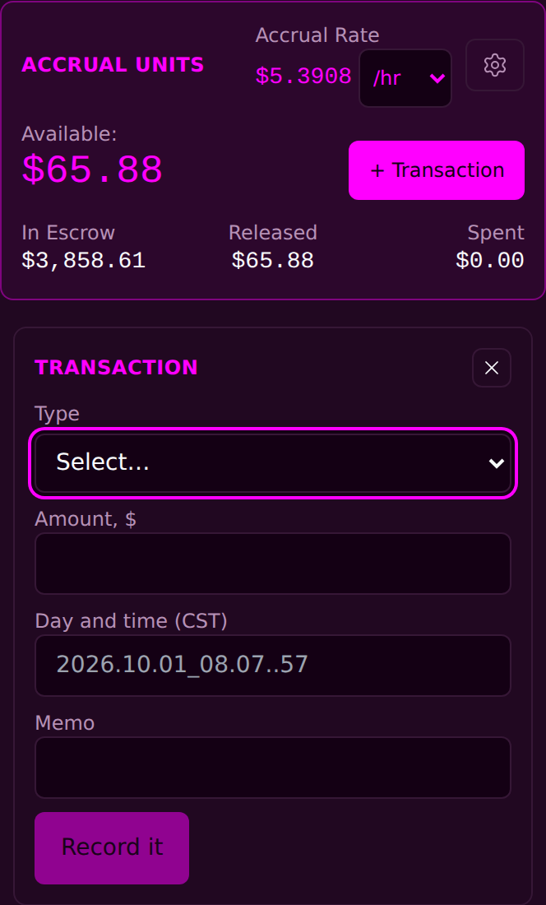

<!-- release-note
{
 "rev": "037",
 "date": "2026-10-01",
 "title": "A smaller + Transaction inside the Accrual Units card; the big button removed",
 "words": [
  {
   "text": "place smaller transaction button in box with accrual units. remove big pink transaction button",
   "addendum": "70"
  }
 ],
 "changed": [
  "The full-width + Transaction button above the card is removed",
  "A smaller + Transaction sits inside the Accrual Units card, on the Available row at the right",
  "Pressing it opens the entry directly below the card"
 ],
 "notChanged": [
  "Still one door",
  "The entry opens with Type blank, folds back after a save, and has the X",
  "The card's figures and the three boxes"
 ],
 "measured": [
  "Exactly one + Transaction on the page; its box lies inside the card's box",
  "Pressed: the entry opens directly below the card with Type = Select…"
 ],
 "recommendation": "The step rail (Step 3 of 4 · Withdraw, with a WITHDRAW pill) still sits above the card. Keep it or remove it?",
 "sha": "fb04ec9",
 "verify": {
  "run": "#2142",
  "state": "running"
 },
 "images": {
  "before": "img/r.037-before.png",
  "after": "img/r.037-after.png",
  "extra": [
   {
    "label": "After · + Transaction pressed",
    "src": "img/r.037-after-open.png"
   }
  ]
 }
}
-->
# r.037 · A smaller + Transaction inside the Accrual Units card; the big button removed

2026-10-01 · https://exel-ai-polling.explore-096.workers.dev/financial-2525

```text
r.037 · A smaller + Transaction inside the Accrual Units card; the big button removed
Your words: "place smaller transaction button in box with accrual units. remove big pink transaction button"   (addendum 70)
Changed:    • The full-width + Transaction button above the card is removed
            • A smaller + Transaction sits inside the Accrual Units card, on the Available row at the right
            • Pressing it opens the entry directly below the card
Not changed: • Still one door
             • The entry opens with Type blank, folds back after a save, and has the X
             • The card's figures and the three boxes
Measured:   • Exactly one + Transaction on the page; its box lies inside the card's box
            • Pressed: the entry opens directly below the card with Type = Select…
My recommendation / question: The step rail (Step 3 of 4 · Withdraw, with a WITHDRAW pill) still sits above the card. Keep it or remove it?
SHA fb04ec9 | committed ✓ | pushed ✓ | Verify Live #2142 running
```






