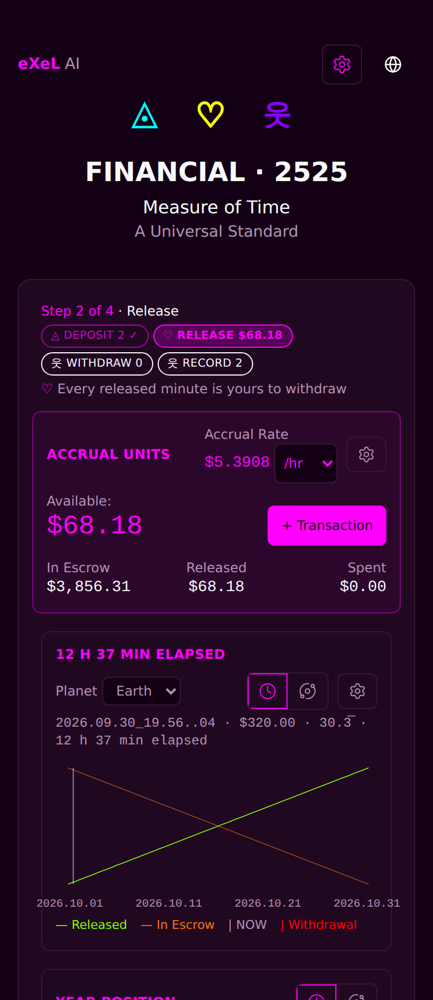
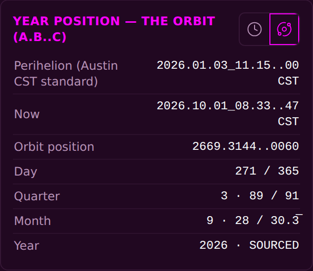
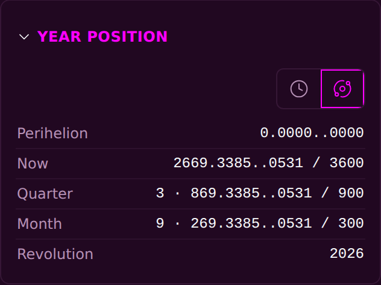
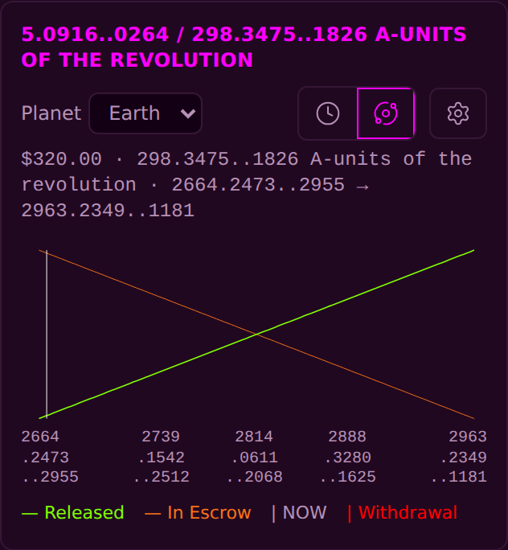

<!-- release-note
{
 "rev": "038",
 "date": "2026-10-01",
 "title": "No step rail; Accrual, Budget, Chart; the year card folded at the end, one system at a time",
 "words": [
  {
   "text": "year position is either Gregorian or A.B..C\n\nnot a mix of both",
   "addendum": "72"
  },
  {
   "text": "get rid of this; adds no value; then reorder widgets:\n\nAccrual\nBudget\nCharts",
   "addendum": "73"
  },
  {
   "text": "keep as is, just move year secrion to end idefaulted just title so one can open up menubfor setail and see clock vs MoT icon and details",
   "addendum": "73 (your answer)"
  }
 ],
 "changed": [
  "The step rail (Step 3 of 4 · Withdraw, its pills and sentence) is gone",
  "Order: Accrual Units (and the entry below it) · Personal budget · Chart · Record · Year position · sign-in · Trinity",
  "The year card sits at the end, closed to its title; opening it shows the Clock / MoT icons and the rows",
  "Year on MoT is A.B..C only: Perihelion 0.0000..0000 · Now out of 3600 · Quarter out of 900 · Month out of 300 · Revolution",
  "On MoT the chart's top line, the chart tap readout and the Accrual gear show A.B..C only; on Clock, dates and hours only"
 ],
 "notChanged": [
  "Year on Clock: the same rows as before (your answer)",
  "Every figure, entry and the budget amounts",
  "The Accrual Units card, the + Transaction door and the entry form"
 ],
 "measured": [
  "Card tops in order on the built page: Accrual < Budget < Chart < Record < Year < sign-in",
  "Year on MoT reads no CST and no 91-day or 30.3̅ counts",
  "Chart line on MoT reads no date: 20.00 · 298.3475..1826 A · start → end"
 ],
 "recommendation": "none",
 "sha": "ddedbe6",
 "verify": {
  "run": "pending",
  "state": "running"
 },
 "images": {
  "before": "img/r.038-before.png",
  "after": "img/r.038-after.png",
  "extra": [
   {
    "label": "Before · year card on MoT (mixed)",
    "src": "img/r.038-before-year-mot.png"
   },
   {
    "label": "After · year card folded",
    "src": "img/r.038-after-year-folded.png"
   },
   {
    "label": "After · year card on MoT (A.B..C only)",
    "src": "img/r.038-after-year-mot.png"
   },
   {
    "label": "After · chart on MoT",
    "src": "img/r.038-after-chart-mot.png"
   }
  ]
 }
}
-->
# r.038 · No step rail; Accrual, Budget, Chart; the year card folded at the end, one system at a time

2026-10-01 · https://exel-ai-polling.explore-096.workers.dev/financial-2525

```text
r.038 · No step rail; Accrual, Budget, Chart; the year card folded at the end, one system at a time
Your words: "year position is either Gregorian or A.B..C

not a mix of both"   (addendum 72)
            "get rid of this; adds no value; then reorder widgets:

Accrual
Budget
Charts"   (addendum 73)
            "keep as is, just move year secrion to end idefaulted just title so one can open up menubfor setail and see clock vs MoT icon and details"   (addendum 73 (your answer))
Changed:    • The step rail (Step 3 of 4 · Withdraw, its pills and sentence) is gone
            • Order: Accrual Units (and the entry below it) · Personal budget · Chart · Record · Year position · sign-in · Trinity
            • The year card sits at the end, closed to its title; opening it shows the Clock / MoT icons and the rows
            • Year on MoT is A.B..C only: Perihelion 0.0000..0000 · Now out of 3600 · Quarter out of 900 · Month out of 300 · Revolution
            • On MoT the chart's top line, the chart tap readout and the Accrual gear show A.B..C only; on Clock, dates and hours only
Not changed: • Year on Clock: the same rows as before (your answer)
             • Every figure, entry and the budget amounts
             • The Accrual Units card, the + Transaction door and the entry form
Measured:   • Card tops in order on the built page: Accrual < Budget < Chart < Record < Year < sign-in
            • Year on MoT reads no CST and no 91-day or 30.3̅ counts
            • Chart line on MoT reads no date: 20.00 · 298.3475..1826 A · start → end
My recommendation / question: none
SHA ddedbe6 | committed ✓ | pushed ✓ | Verify Live pending running
```










