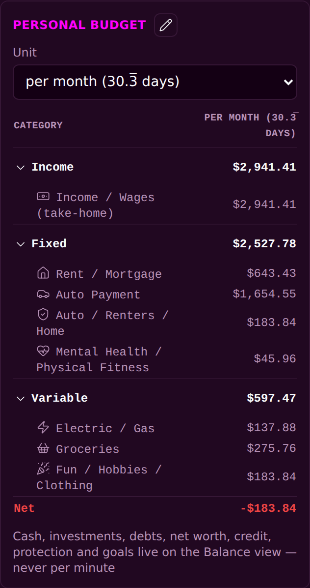
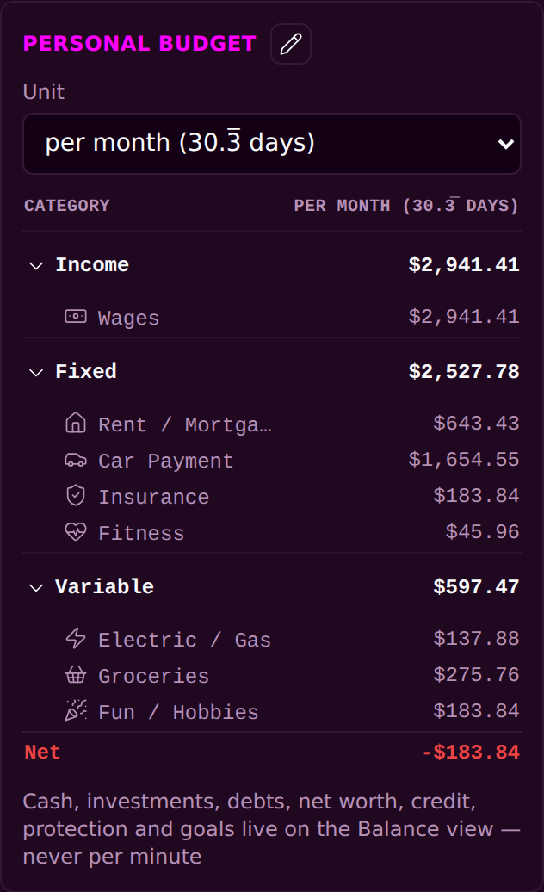

<!-- release-note
{
 "rev": "040",
 "date": "2026-10-01",
 "title": "One line per budget entry: short names, … if still long",
 "words": [
  {
   "text": "heres example to use also try reducing each entry on line (maybe make … or scroll ton-see rest of text) if you cant reduce text\n\nfor instance personal fotness should be fitness",
   "addendum": "75"
  }
 ],
 "changed": [
  "Every budget line sits on one row with a short name: Mental Health / Physical Fitness → Fitness, Income / Wages (take-home) → Wages, Auto / Renters / Home → Insurance, Subscriptions / AI / Cloud → Subscriptions, Credit Cards / Student Loans → Credit Cards, Fun / Hobbies / Clothing → Fun / Hobbies, Gifts / Holidays / Travel → Gifts / Travel, Dining / Work → Dining (46 short names in all)",
  "A name that still runs long ends in …; hold or hover a row to see its full name",
  "The amount column header stays on one line"
 ],
 "notChanged": [
  "The full names stay in the pickers and in the Transaction record",
  "Every amount and total"
 ],
 "measured": [
  "On the built page at 390 px every budget line is one row",
  "Rent / Mortgage ends in … at 390 px (your fallback rule); it fits once the 30-day month makes the column header shorter"
 ],
 "recommendation": "none",
 "sha": "61a563d",
 "verify": {
  "run": "#2155",
  "state": "pass"
 },
 "images": {
  "before": "img/r.040-before.png",
  "after": "img/r.040-after.png"
 }
}
-->
# r.040 · One line per budget entry: short names, … if still long

2026-10-01 · https://exel-ai-polling.explore-096.workers.dev/financial-2525

```text
r.040 · One line per budget entry: short names, … if still long
Your words: "heres example to use also try reducing each entry on line (maybe make … or scroll ton-see rest of text) if you cant reduce text

for instance personal fotness should be fitness"   (addendum 75)
Changed:    • Every budget line sits on one row with a short name: Mental Health / Physical Fitness → Fitness, Income / Wages (take-home) → Wages, Auto / Renters / Home → Insurance, Subscriptions / AI / Cloud → Subscriptions, Credit Cards / Student Loans → Credit Cards, Fun / Hobbies / Clothing → Fun / Hobbies, Gifts / Holidays / Travel → Gifts / Travel, Dining / Work → Dining (46 short names in all)
            • A name that still runs long ends in …; hold or hover a row to see its full name
            • The amount column header stays on one line
Not changed: • The full names stay in the pickers and in the Transaction record
             • Every amount and total
Measured:   • On the built page at 390 px every budget line is one row
            • Rent / Mortgage ends in … at 390 px (your fallback rule); it fits once the 30-day month makes the column header shorter
My recommendation / question: none
SHA 61a563d | committed ✓ | pushed ✓ | Verify Live #2155 ✓
```




