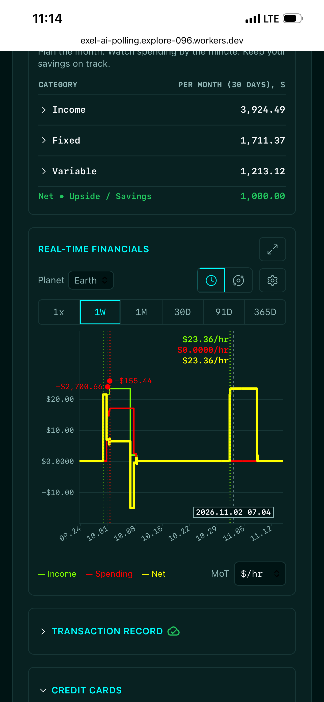
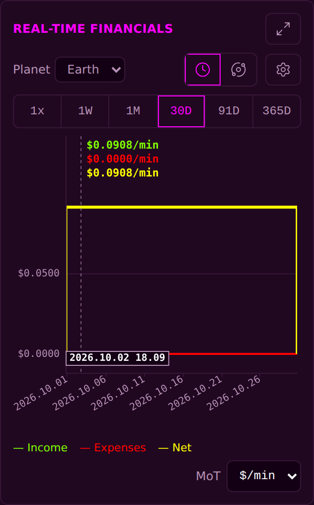

<!-- release-note
{
 "rev": "073",
 "date": "2026-10-03",
 "title": "A finished entry is never lost; every field editable; Expenses; overlapping dots merge; the full-screen chart fits",
 "words": [
  {
   "text": "the trinity logo should be method from Main and already use right text sizes / make red spending on chart: Spending / Change to : Expenses",
   "addendum": "168"
  },
  {
   "text": "if the expense circle overlaps (left or right edge overlaps with another expense, merge). 2700.66 and 155.44 should merge (sum up) as one red dot since they are overlapping",
   "addendum": "171"
  },
  {
   "text": "full screen mode with financial chart messes up. not all is legible",
   "addendum": "165"
  },
  {
   "text": "all fields in edit of Transaction record should be possible to edit",
   "addendum": "164"
  },
  {
   "text": "ensure these are available on login via supabase to be pushed on PC under same OAuth account",
   "addendum": "182"
  }
 ],
 "changed": [
  "A finished entry is never lost: two tabs or two devices are united; a full phone keeps the form open and retries; an edit is a correction, never a second entry",
  "Every field of a recorded transaction can be edited from its pencil; the edit history marks are gone from the record (your addendum 163)",
  "The chart's red line reads Expenses; expense dots that touch or overlap side to side merge into one dot with the summed amount",
  "The full-screen chart fits the screen you see, zoomed or in landscape; it comes back where you were when closed",
  "Your budget and your cards never go back to an older copy on any device; a budget you never edited never overwrites one you did; every return to the page reads your account first",
  "The green cloud means your account holds exactly what the page shows — any change turns it grey until it is saved",
  "A card in credit can be edited again; a refused budget figure leaves the line as it was and says why"
 ],
 "notChanged": [
  "Every amount, rate and budget figure",
  "The Trinity logo at the top (now drawn exactly the way Main draws it)"
 ],
 "measured": [
  "Live account test on the real site and Supabase: a transaction, a typed budget line (Rent 777) and an added card reach the database and come back on a second browser under the same sign-in — 16/17 (the one miss is the Drone page's feedback button, B-65)",
  "Built-page checks: full phone + account key order 20/0; phone and landscape layout 94/0; tests 155 + 221 + 597 all pass"
 ],
 "recommendation": "Reload every open Financial tab on every device once; the first sign-in may unite your phone with your account's copy.",
 "sha": "28541b7",
 "verify": {
  "run": "#2258",
  "state": "pass"
 },
 "images": {
  "before": "img/r.073-before.png",
  "after": "img/r.073-after.png"
 }
}
-->
# r.073 · A finished entry is never lost; every field editable; Expenses; overlapping dots merge; the full-screen chart fits

2026-10-03 · https://exel-ai-polling.explore-096.workers.dev/financial-2525

```text
r.073 · A finished entry is never lost; every field editable; Expenses; overlapping dots merge; the full-screen chart fits
Your words: "the trinity logo should be method from Main and already use right text sizes / make red spending on chart: Spending / Change to : Expenses"   (addendum 168)
Your words: "if the expense circle overlaps (left or right edge overlaps with another expense, merge). 2700.66 and 155.44 should merge (sum up) as one red dot since they are overlapping"   (addendum 171)
Your words: "full screen mode with financial chart messes up. not all is legible"   (addendum 165)
Your words: "all fields in edit of Transaction record should be possible to edit"   (addendum 164)
Your words: "ensure these are available on login via supabase to be pushed on PC under same OAuth account"   (addendum 182)
Changed:    • A finished entry is never lost: two tabs or two devices are united; a full phone keeps the form open and retries; an edit is a correction, never a second entry
            • Every field of a recorded transaction can be edited from its pencil; the edit history marks are gone from the record (your addendum 163)
            • The chart's red line reads Expenses; expense dots that touch or overlap side to side merge into one dot with the summed amount
            • The full-screen chart fits the screen you see, zoomed or in landscape; it comes back where you were when closed
            • Your budget and your cards never go back to an older copy on any device; a budget you never edited never overwrites one you did; every return to the page reads your account first
            • The green cloud means your account holds exactly what the page shows — any change turns it grey until it is saved
            • A card in credit can be edited again; a refused budget figure leaves the line as it was and says why
Not changed: • Every amount, rate and budget figure
             • The Trinity logo at the top (now drawn exactly the way Main draws it)
Measured:   • Live account test on the real site and Supabase: a transaction, a typed budget line (Rent 777) and an added card reach the database and come back on a second browser under the same sign-in — 16/17 (the one miss is the Drone page's feedback button, B-65)
            • Built-page checks: full phone + account key order 20/0; phone and landscape layout 94/0; tests 155 + 221 + 597 all pass
My recommendation / question: Reload every open Financial tab on every device once; the first sign-in may unite your phone with your account's copy.
SHA 28541b7 | committed ✓ | pushed ✓ | Verify Live #2258 ✓
```




