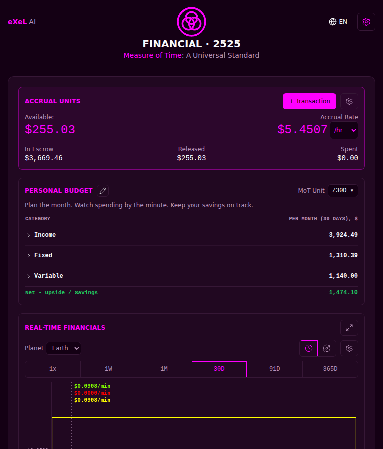
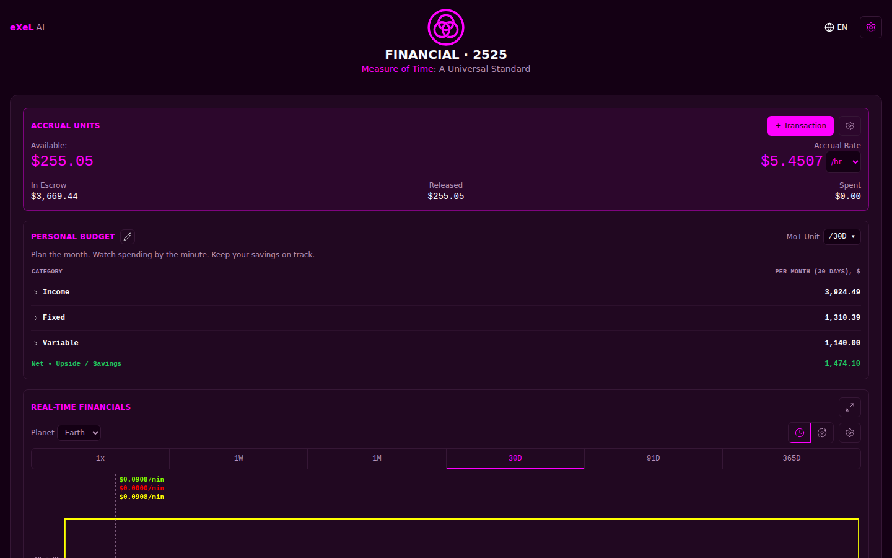

<!-- release-note
{
 "rev": "074",
 "date": "2026-10-03",
 "title": "One column, full width on a PC and on a phone held sideways",
 "words": [
  {
   "text": "Fix the push; after 12 AsM identify opportunities.  Also, landscape on PC is not full width; please fix just like we did for Security-2525 Mision Planning.  Landscape on phone should also work.",
   "addendum": "188"
  },
  {
   "text": "Same column, full width",
   "addendum": "184"
  }
 ],
 "changed": [
  "The page is no longer a 768 px strip: on a PC and on a phone held sideways every card reaches the screen's edges, with a 16 px margin each side",
  "The $ chart grows longer on a wide screen instead of taller (never more than 300 px at rest); full screen keeps its fitted height across the whole width"
 ],
 "notChanged": [
  "The order of the cards, every figure and every control",
  "A phone held upright looks exactly as it did — the $ chart keeps its same drawing"
 ],
 "measured": [
  "On the built page at 1440×900, 1280×720, 1920×1080 and 844×390 the column spans the screen and every card is the screen's width less the margins; nothing scrolls sideways; the $ chart fills its card at 100–300 px tall — layout check 111/0",
  "On a 390 px phone upright the $ chart's drawing is still 360 × 150"
 ],
 "recommendation": "Open it on your PC and turn your phone sideways; reload once if you still see the narrow strip.",
 "sha": "b96a632",
 "verify": {
  "run": "#2261",
  "state": "pass"
 },
 "images": {
  "before": "img/r.074-before.png",
  "after": "img/r.074-after.png"
 }
}
-->
# r.074 · One column, full width on a PC and on a phone held sideways

2026-10-03 · https://exel-ai-polling.explore-096.workers.dev/financial-2525

```text
r.074 · One column, full width on a PC and on a phone held sideways
Your words: "Fix the push; after 12 AsM identify opportunities.  Also, landscape on PC is not full width; please fix just like we did for Security-2525 Mision Planning.  Landscape on phone should also work."   (addendum 188)
            "Same column, full width"   (addendum 184)
Changed:    • The page is no longer a 768 px strip: on a PC and on a phone held sideways every card reaches the screen's edges, with a 16 px margin each side
            • The $ chart grows longer on a wide screen instead of taller (never more than 300 px at rest); full screen keeps its fitted height across the whole width
Not changed: • The order of the cards, every figure and every control
             • A phone held upright looks exactly as it did — the $ chart keeps its same drawing
Measured:   • On the built page at 1440×900, 1280×720, 1920×1080 and 844×390 the column spans the screen and every card is the screen's width less the margins; nothing scrolls sideways; the $ chart fills its card at 100–300 px tall — layout check 111/0
            • On a 390 px phone upright the $ chart's drawing is still 360 × 150
My recommendation / question: Open it on your PC and turn your phone sideways; reload once if you still see the narrow strip.
SHA b96a632 | committed ✓ | pushed ✓ | Verify Live #2261 ✓
```




